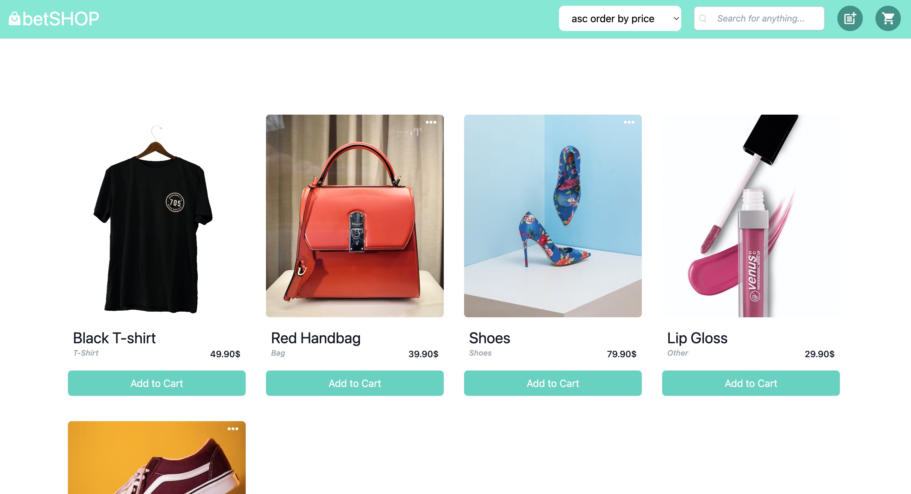
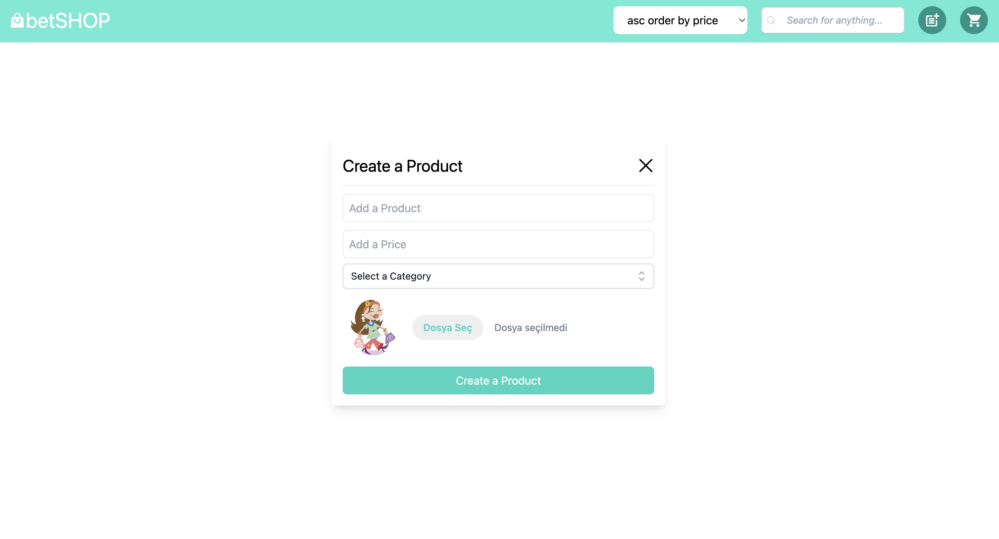
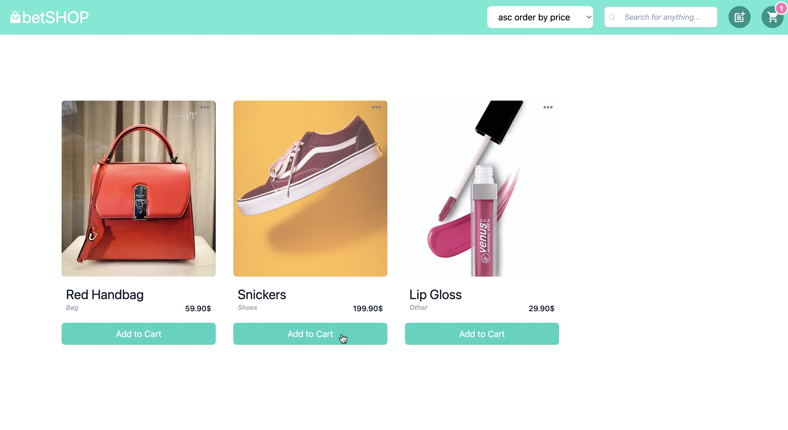
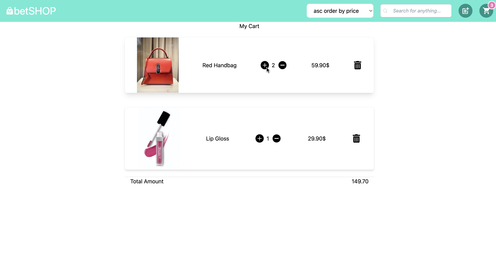
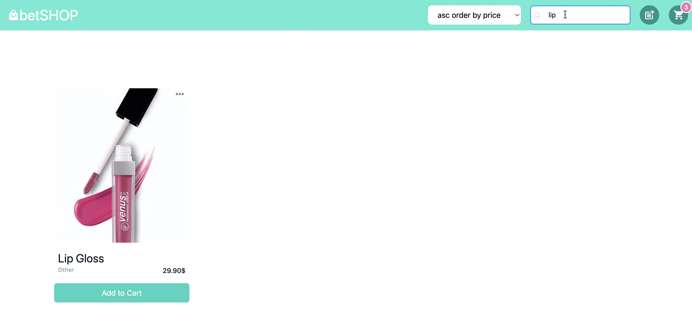
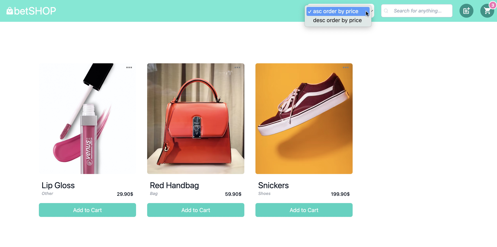
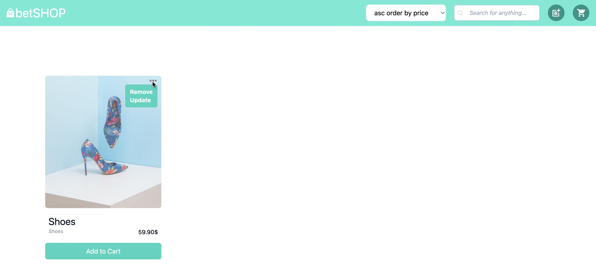

# React Vite Shopping Cart App

This project contains a simple shopping cart application built with <b>React Vite.</b> The application allows users to add various products to their cart, view the cart contents, and remove items from the cart, providing a basic shopping experience. It also utilizes popular libraries and tools like <b>Redux</b>, <b>React Router Dom</b>,  <b>Tailwind CSS</b> and <b>Netlify</b>.



## Getting Started

These instructions will guide you through the steps required to run the project in a local development environment.

### Prerequisites

To run this project, you need the following software installed:

- [Node.js](https://nodejs.org/) - The platform used to run JavaScript.
- [npm](https://www.npmjs.com/) or [Yarn](https://yarnpkg.com/) - Package management.

### Installation

1. Clone this project to your local machine or download it as a ZIP file.

```bash
git clone https://github.com/FatmaBetulUyar/ShoppingCart.git
```

2. Navigate to the project directory.

```bash
cd ShoppingCart
```

3. Install the required dependencies by running the following command:

```bash
npm install
```

4. Once the project dependencies are successfully installed, start the development server with the following command:

```bash
npm start
```
5. The application will start on a local server, and your default web browser will open automatically. You can view the application by visiting `http://localhost:3000` in your browser.

## Usage

This shopping cart application includes the following basic features:
- Click the "Create a Product" button to <b>add new product.</b><br>
  
- Click the "Add to Cart" button to <b>add products to the cart.</b><br>
  
- Click the "Cart" button to <b>view the cart.</b><br>
  
- Click the "-" and "+" buttons to <b>increase</b> and <b>decrease</b> number of products in the cart.<br>
  
- Click the "Remove" button to <b>remove product</b> from the cart.<br>
 
- Click the "Search" button to <b>search</b> items.
  
- Click the "Order" button to <b>order</b>  products by desc or asc.<br>
  
- Click the "Update" or "Remove" button to <b>update</b>  or <b>remove</b> a product.<br>
  

 ## Live Demo
 You can view a live demo of this project  [here](https://magenta-otter-8213be.netlify.app/).

## Technologies and Libraries Used

This project utilizes the following technologies and libraries:

- [React](https://reactjs.org/) - A JavaScript library used to build the user interface.
- [React Vite](https://vitejs.dev/) - A fast JavaScript build tool that provides a quick development environment.
- [Redux](https://redux.js.org/) - A JavaScript library for state management.
- [React Router Dom](https://reactrouter.com/web/guides/quick-start) - A library for navigation in React applications.
- [Tailwind CSS](https://tailwindcss.com/) - A customizable CSS framework for rapid UI development.
